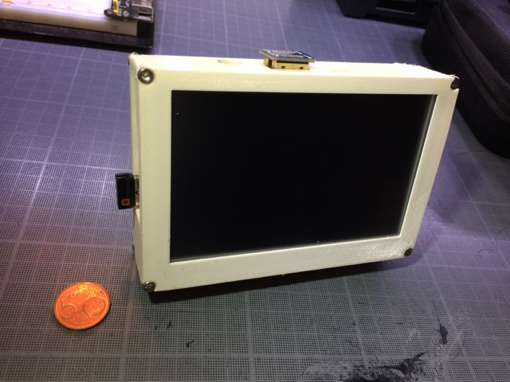

# Raspberry Pi Case for 5" LCD

For Raspberry Pi B 2/3 and a [5inch HDMI LCD](https://web.archive.org/save/_embed/https://ru.aliexpress.com/item/Raspberry-Pi-Pi2-5inch-A-B-2B-LCD-Raspberry-pie-LCD-touch-screen/32710427826.html?ws_ab_test=searchweb0_0%2Csearchweb201602_1_116_10065_117_10068_114_115_113_10000009_10084_10083_10080_10082_10081_10060_10061_10062_10056_10055_10054_10059_10099_10078_10079_427_10103_10073_10102_10096_10052_10050_10051-10051%2Csearchweb201603_4%2Cafswitch_4&btsid=58234cae-b869-45e8-aaab-466812a54425).

